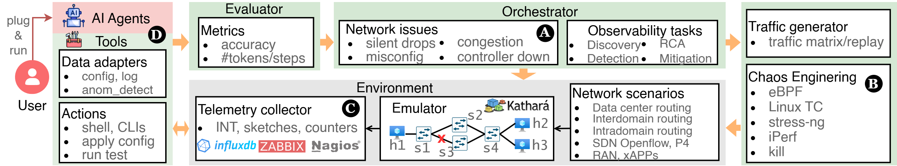

<div align="center">
<h1>LLM4NetLab</h1>

[🤖Overview](#🤖overview) | 
[📦Installation](#📦installation) | 
[🚀Quick Start](#🚀quick-start) | 
[🛠️Usage](#🛠️usage) | 
[📚Cite](#📚cite)

[](https://arxiv.org/abs/2507.01997v1)

</div>

<h2 id="🤖overview">🤖 Overview</h2>



LLM4NetLab is a standardized, reproducible, and open benchmarking platform to build and evaluate AI agents on network troubleshooting with low operational effort. This platform primarily aims to *standardize* and *democratize* the experimentation with AI agents, by enabling researchers and practitioners -- including non domain-experts such as ML engineers and data scientists -- to focus on the evaluation of AI agents on curated problem sets, without concern for underlying operational complexities. Custom AI agents can be easily plugged through a single API and rapidly evaluated.

This is the code repository for the paper [Towards a Playground to Democratize Experimentation and Benchmarking of AI Agents for Network Troubleshooting](https://arxiv.org/abs/2507.01997), which was accepted at the [ACM SIGCOMM 2025 1st Workshop on Next-Generation Network Observability (NGNO)](https://conferences.sigcomm.org/sigcomm/2025/workshop/ngno/).

💡 **Note:** We are actively developing LLM4NetLab. If you have any suggestions or are interested in contributing, feel free to reach out to us!

## Features

- Standardized network troubleshooting environment based on Kathará
- Easy-to-use API for integrating custom AI agents
- Pre-built network scenarios and fault injection mechanisms
- Reproducible evaluation framework
- Support for various network topologies and configurations

<h2 id="📦installation">📦 Installation</h2>

## Requirements

- [Kathará](https://www.kathara.org/). 
  Follow the [official installation guide](https://github.com/KatharaFramework/Kathara?tab=readme-ov-file#installation) to install Kathará.
- Python >= 3.10


## Setup

Clone the repository and install the dependencies. LLM4NetLab uses [Poetry](https://python-poetry.org/docs/) to manage the dependencies. Follow [Poetry installation instructions](https://python-poetry.org/docs/#installation) to install Poetry. You can also use a standard `pip install -e .` to install the dependencies.

```shell
git clone https://github.com/zhihao1998/LLM4NetLab.git  
poetry env use python3.10
export PATH="$HOME/.local/bin:$PATH" # export poetry to PATH if needed
poetry install # -vvv for verbose output
poetry self add poetry-plugin-shell # installs poetry shell plugin
poetry shell
```

The Kathará API relies on Docker to function properly. We recommend to add current user to docker group to avoid calling with `sudo`. **However, please be aware of the security implications of this action.**

```shell
sudo usermod -aG docker $USER
```

Login again or activate temporaily with 

```shell
newgrp docker
```

<h2 id="🚀quick-start">🚀 Quick Start</h2>

## Configure your LLM

Configure the LLM you want to use and corresponding settings in `config/config.yaml`. For example, to use a remote DeepSeek R1, you can set:

```yaml
llm: deepseek
use_local: false
deepseek:
  remote:
    url: https://api.deepseek.com
    model: deepseek-reasoner
    key: YOUR_API_KEY
```

We use OpenAI-compatible API for LLMs, so you can also add other LLMs that support this API, such as GPT, Qwen, etc.


## Example

You can find examples under `examples`, which show how to specify the network scenarios, tasks, and problems. For example, to run simple packet loss detection task on a simple L2 network scenario with an react agent, you can do the following:

```python
# 1. Define orchestrator and agent
orchestrator = Orchestrator()
agent = ReactAgent()
orchestrator.register_agent(agent, "react")

# 2. Initialize the problem
# Find more problems under `llm4netlab/orchestrator/problems`
task_desc, instructions, actions = orchestrator.init_problem("packet_loss_detection")
print("Task description:", task_desc)
print("Instructions:", instructions)
print("Actions:", actions)

# 3. Initialize the agent context with task description, instructions, and actions
agent.init_context(task_desc, instructions, actions)
print("Agent context initialized.")

# 4. Start the problem with a maximum number of steps
asyncio.run(orchestrator.start_problem(max_steps=30))

# 5. Stop the problem and clean the environments after completion
orchestrator.stop_problem()
```

More examples are on the way.

<h2 id="🛠️usage">🛠️ Usage</h2>

## Network Scenarios

LLM4NetLab supports multiple network scenarios under the `net_env` directory, including data center networks, interdomain routing, intradomain routing, etc. The scenarios can be implemented using different emulation frameworks, such as Kathará, Mininet. 

**Now we only present examples with Kathará. More scenarios coming soon...** 

Each scenario is defined in a Kathará `lab.py` file, which specifies the network topology, devices, and initial configurations. Check [Kathará API Docs](https://github.com/KatharaFramework/Kathara/wiki/Kathara-API-Docs) for more details if you want to create your scenarios.

## Tasks and Problems

Check all available problems and corresponing names at `llm4netlab/orchestrator/problems`.

## Network Issues

LLM4NetLab supports various network issues, such as packet loss, delay, congestion, etc. These issues can be injected into the network scenarios using the fault injection mechanism. The faults are defined in `llm4netlab/generator/fault`, which provides a base class for fault injectors and specific implementations for different types of faults.

## Traffic Generation

LLM4NetLab supports traffic generation, which can generate traffic according to traffic matrix or offline traces. 

<h2 id="📚cite">📚 Cite</h2>

```bibtex
@inproceedings{wang2025towards,
  title = {Towards a Playground to Democratize Experimentation and Benchmarking of AI Agents for Network Troubleshooting},
  author = {Zhihao Wang, Alessandro Cornacchia, Franco Galante, Carlo Centofanti, Alessio Sacco and Dingde Jiang},
  year = {2025},
  booktitle = {Proceedings of the 2025 SIGCOMM Workshop on Next-Generation Network Observability},
  url={https://arxiv.org/abs/2507.01997}, 
}
```

# Acknowledgement

This project is largely motivated by [AIOpsLab](https://github.com/microsoft/AIOpsLab). We sincerely thank the authors for their excellent work.

# Licence

Licensed under the MIT license.